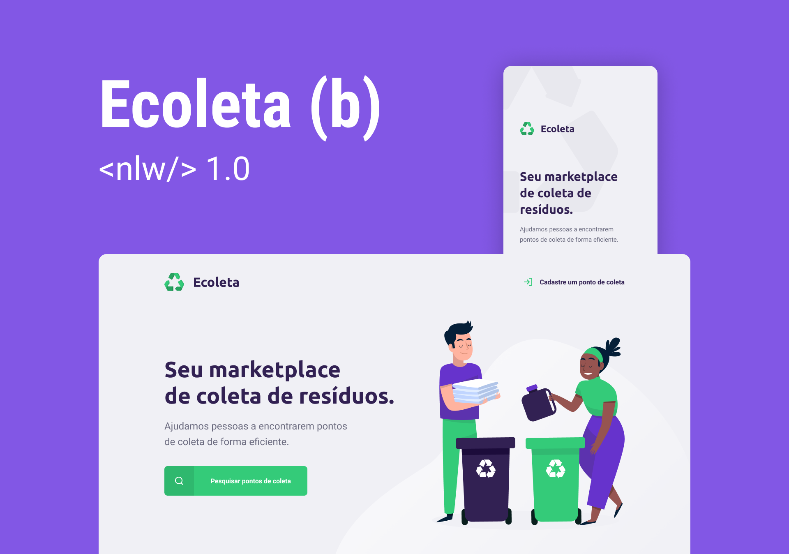

###### nlw-1
# Rocketseat - Next Level Week - 1

Projeto desenvolvido na semana: Ecoleta.

## Ecoleta
Serve como uma conexão entre empresas coletoras de resíduos a pessoas que precisam descartar.

## Dia 1: Conceitos e ambiente
[Anotações dia 1](notas/Dia1.md)

## Dia 2: Back-end da Aplicação
[Anotações dia 2](notas/Dia2.md)

## Dia 3: Front-end web da Aplicação
[Anotações dia 3](notas/Dia3.md)

## Dia 4: Front-end Mobile da Aplicação
[Anotações dia 4](notas/Dia4.md)

## Dia 5: Recursos Avançados
[Anotações dia 5](notas/Dia5.md)

